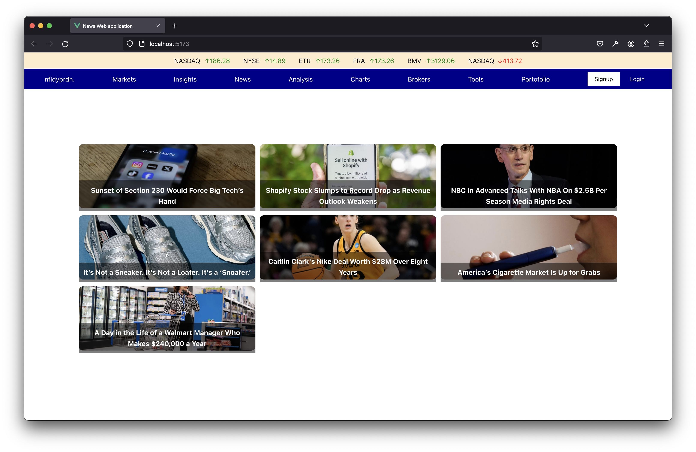

# vue-news

I built this application just to learn vue,

it is built using:

1. vue.js
2. pinia (state manager/store)
3. fetch data (GET) => fetch some api on rapidapi and newsapi
4. file .env for sensitive data

#### How-to run this application

1. git clone this repo
2. copy .env.example to .env
   > cp .env.example .env
3. generate your own api key
4. start the project
   > npm run dev
